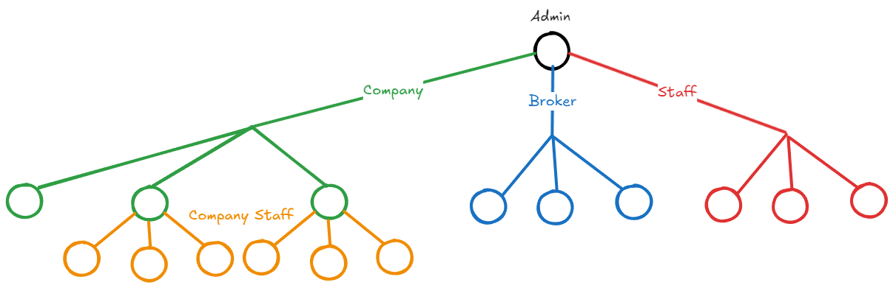

# 1. User Stories



## **Authentication (All Users):**
- As a user (any role), I want to log in using my registered phone number and OTP, so that I can securely access the platform based on my assigned role.
- As a user, I want my session to recognize my exact role upon login so that the frontend can route me to my specific dashboard automatically.
- As a user, I want my logged-in session to remain active for a long time, so that let me login once and improve my user experience.
- As a user, I want to logout from the app, so that let me switch to another account, or make a new profile.

# 2. Acceptance Criteria & Edge Cases

## Feature: User Login
*   **Acceptance Criteria:**
    *   Given a valid phone number and a valid OTP code, the system returns a JWT token containing `id_user`, `role`, and `id_company` (if applicable).
    *   Given a non-existent phone number, the system returns a 404 Not Found or generic 401 Unauthorized.
    *   If `is_active` is FALSE for the user (or their parent company), the login fails with an account suspended error.
    *   Session token is saved locally on mobile app or web browser.
*   **Edge Cases:**
    *   A user is promoted to a new role while they have an active session (JWT needs refresh handling or the frontend must force re-login on 403 errors).

# 3. API Endpoints (Login & Roles)

## 1. Request Login OTP
*   **Endpoint:** `POST /api/auth/request-otp`
*   **Description:** Initiates the login process by sending a 6-digit code to the user's phone.
*   **Request Body:**
    ```json
    {
      "phone": "+1234567890"
    }
    ```
*   **Response (200 OK):**
    ```json
    {
      "message": "OTP sent successfully.",
      "expires_in": "300" // seconds
    }
    ```
*   **Error Responses:**
    *   `429 Too Many Requests`: User requested OTP too many times in a short period.
    *   `403 Forbidden`: This phone number belongs to an account that has been explicitly deactivated.

## 2. Verify OTP (Final Login)
*   **Endpoint:** `POST /api/auth/verify-otp`
*   **Description:** Verifies the OTP and returns the session token. If the phone number does not exist in the database, a new user record is automatically created with the role `CUSTOMER`.
*   **Request Body:**
    ```json
    {
      "phone": "+1234567890",
      "otp_code": "123456"
    }
    ```
*   **Response (200 OK):**
    *   Option A: Existing User (e.g., Company Staff)
    ```json
    {
      "token": "eyJhbGciOiJIUzI1...",
      "user": {
        "id_user": 105,
        "first_name": "John",
            "Last_name": "Doe",
        "role": "COMPANY_STAFF",
        "id_company": 12
      }
    }
    ```
    *   Option B: New User (Registration)
    ```json
    {
        "token": "eyJhbGciOiJIUzI1...",
        "is_new_user": true,
        "user": {
            "id_user": 106,
            "first_name": null,
            "Last_name": null,
            "role": "CUSTOMER",
            "id_company": null
        }
    }
    ```
*   **Error Responses:**
    *   `401 Unauthorized`: Invalid or expired OTP.
    *   `403 Forbidden`: User or Company account is deactivated (`is_active: false`).

# 4. Database Schema (Entities & Attributes)

## 2. Table: `User`
Extended for authentication, standardizing roles, and linking to companies.
*   **`id_user`** (PK, UUID/INT): Unique identifier for the user.
*   **`id_company`** (FK -> `Company.id_company`, Nullable): Populated only for users with the role `COMPANY_ADMIN` and `COMPANY_STAFF`.
*   **`username`** (VARCHAR, Unique): Unique identifier name (optional).
*   **`phone`** (VARCHAR, Unique): Primary login identifier (with country code).
*   **`first_name`** (VARCHAR): User's first name.
*   **`last_name`** (VARCHAR): User's last name.
*   **`role`** (ENUM): User role on the system. Values: `CUSTOMER`, `BROKER`, `COMPANY_ADMIN`, `COMPANY_STAFF`, `SHAQQA_ADMIN`, `SHAQQA_STAFF`.
*   **`is_active`** (BOOLEAN): Default `TRUE`. Used by admins to ban or suspend users.
*   **`created_at`** (TIMESTAMP): User registration timestamp.